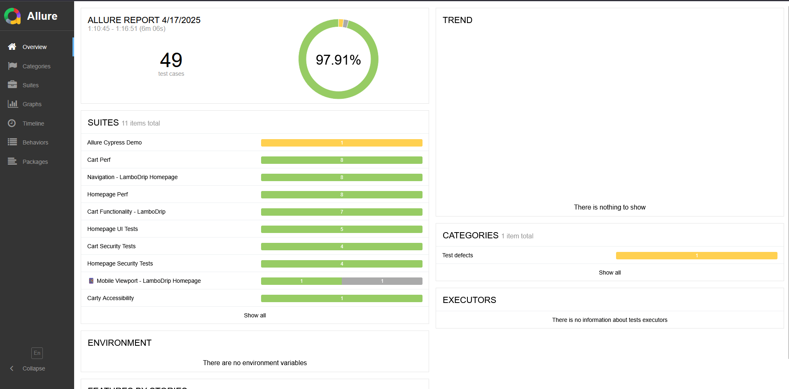
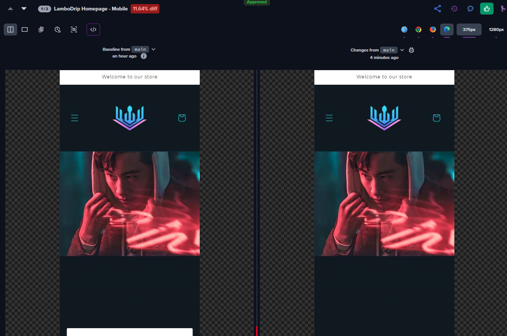

# TestingIsForeplay


**Nothing flaky allowed — unless it's intentional. 😉**

Welcome to my personal automation playground  
> ⚠️ This repo contains explicit attention to detail and intense QA sessions.

---

## 🔥 Let’s get intimate (with the code)

This repo is crafted to showcase:

- 🔬 Real-world QA flows, tested with **Cypress**, **Playwright** & **Percy**
- 🧠 **Manual QA approach** with clean test case writing & bug templates
- 🛠️ **CI/CD pipeline integration** via GitHub Actions
- 💅 Code that’s clean, readable, and unapologetically confident

---

## 💚 What’s inside?

- 📝 **Manual test cases** & execution reports
- 🐞 **Bug reporting templates**
- ✅ **Cypress & Playwright e2e test suites**
- 🖼️ **Visual regression testing with Percy**
- ⚙️ **GitHub Actions** already wired for CI on push
- 🔐 **Clean structure**, no bloat — just effective QA
- 🚀 **Load testing scripts** using k6 for stress simulation
- 🛡️ **OWASP ZAP baseline security scans** with reports
- 🐳 **Docker support** for instant local runs — no setup needed

---

## 💡 Why “TestingIsForeplay”?

Because **good QA is anticipation**.  
You don’t go to production without a bit of build-up.  
And when foreplay is that good… you might skip the release notes entirely. 😉

---

## 🧪 Stack & Tools

| Category               | Tools                                                                       |
|------------------------|-----------------------------------------------------------------------------|
| ✅ Automated tests     | Cypress (v14+), Playwright (v1.43+), Percy                                  |
| 🖼️ Visual Regression   | Percy (Playwright integration), supports desktop + mobile breakpoints       |
| 🧠 Manual QA           | Markdown-based test cases, Defect templates                                 |
| 🧼 API tests           | Postman, SoapUI                                                             |
| ⚙️ CI/CD               | GitHub Actions CI, Percy snapshots CI-integrated                            |
| 📦 Docs & Reporting    | Master Test Plan, Tracker, QA Tips, Allure  (Cypress HTML reports)          |
| 📱 Responsive Testing  | Cypress Viewport, Percy Multi-Viewport snapshots                            |
| 🛡️ Security Testing    | OWASP ZAP (baseline scan via GitHub Actions)                                |
| 🐳 Containerization    | Docker (Node + Cypress + Playwright + CI-ready image)                       |

---

## 📁 Cypress Tests 


### 🏠 Homepage Tests
- Focus: performance, UI load, localization, accessibility
- Includes mobile/responsive view testing via Cypress viewport emulation
→ [Homepage README](cypress/e2e/Homepage/README.md)

### 🛒 Cart Tests (LamboDrip Store)
- Covers: quantity updates, price calculation, removal, checkout redirects
→ [Cart README](cypress/e2e/Cart/README.md)

---

## ✨ Allure Reporting (Cypress)

**Allure reporting is integrated for Cypress tests** to generate rich, interactive test result dashboards.

### 📦 Setup

- Plugin: [`allure-cypress`](https://www.npmjs.com/package/allure-cypress)
- Reports are generated after test runs via `allure-results` directory
- View with:

```bash
npm run allure:generate
npm run allure:open
```
### ✨ Allure Report Sample


---

## 🎭 Playwright Tests


### 🏠 Homepage Tests
- Mirrors Cypress: perf, security, accessibility, UX flows 
- Includes mobile/responsive view testing via Playwright viewport emulation 
→ [Homepage Playwright](Playwright/tests/Homepage)

### 🛒 Cart Tests
- Similar coverage as Cypress, with fast execution + visual tools  
→ [Cart Playwright README](Playwright/tests/Cart/README.md)

### 📸 Percy (Visual Regression)


- Percy + Playwright setup for screenshot diff across viewports
- Snapshots run for:
  - Homepage (Desktop 1280px / Mobile 375px)
- GitHub Actions triggers Percy on push  
→ Visual regression diff example (Mobile viewport - 375px):


---

## 🚀 Load & Stress Testing


- Tool: k6.io — modern load testing for developers
- Goal: simulate real-world load against the homepage
- Script: [homepage_stress](./k6/homepage_stress_test.js)
- Result sample: 
````
✔ status is 200
✔ page loaded under 1s
````
---

## 🛡️ Security Scanning – OWASP ZAP


- Tool: [OWASP ZAP](https://www.zaproxy.org/) – automated baseline security scan via GitHub Actions  
- Goal: detect common vulnerabilities & misconfigurations (headers, cookies, CSP, etc.)
- Scan type: **passive-only**, safe to run in CI pipelines
- Trigger: manual GitHub workflow (`workflow_dispatch`)
- 🔎 Reports available in [`Docs/21_zap-report`](./Docs/21_zap-report)

---

## 📬 API Tests

### Postman
- Covers: cart actions, API validations
→ [Postman Collection](postman/LamboDrip%20API%20Tests.postman_collection.json)

### SoapUI
- SOAP/XML check for `/cart.js` endpoint, structure + timing
→ [SoapUI Project](SoapUI/LamboDrip_API_Checks-soapui-project.xml)

---

## 🐳 Run Locally with Docker


Want to test everything without setting up Node, Cypress or Playwright locally?  
Just use Docker:

```bash
docker build -t testingisforeplay .
docker run --rm testingisforeplay
````

---

## 📎 QA Docs & Assets

- 🧠 [QA Tips & Best Practices](./Docs/QA_Tips_Best_Practices.md)  
- 🗂️ [Master Test Plan](./Docs/MasterTestPlan/Master_test_Plan.md)  
- ✅ [Test Execution Tracker](./Docs/Test%20Execution%20Tracker/Test_Execution_Tracker.md)  
- 🐛 [Defect Management Template](./Docs/Defect%20Management%20Template/Defect_Management_Template.md)  
- 🚨 [TNR Checklist](./Docs/TNR%20Checklist/TNR_Checklist.md)  
- 🎯 [Why QA Matters (PPT & PDF)](./Docs/Why_QA)  

---

## 🔮 Next Chapter?

✅ Done:

- Cypress e2e 🟢  
- Playwright e2e 🟢  
- Responsive & mobile testing 🟢  
- Postman & SoapUI 🟢  
- Percy visual testing 🟢
- k6 load test script 🟢
- OWASP ZAP 🟢
- Dockerfile 🟢
- Allure reporting integration (Cypress) 🟢

---

## 👩‍💻 About Me

**QA Automation Consultant — 6+ years experience. Remote only.**  
I build test strategy from scratch, automate smart (not flaky), and write docs you’ll actually want to read.  
Startups, messy legacy, or chaos-driven sprints? I bring calm, structure, and serious coverage.

> Want more than just a README?

→ [GitHub](https://github.com/molambat/QAbyDayNSFWbyNight)  
→ [All My Links](https://linkr.bio/m.lambat)

---

> Ready to play ? Slide into my DMs. I promise I won’t bite... unless you ask nicely.


